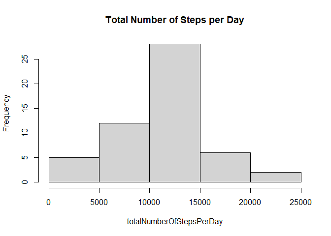
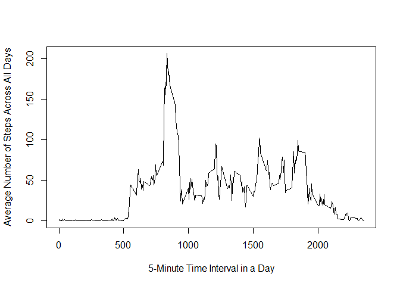
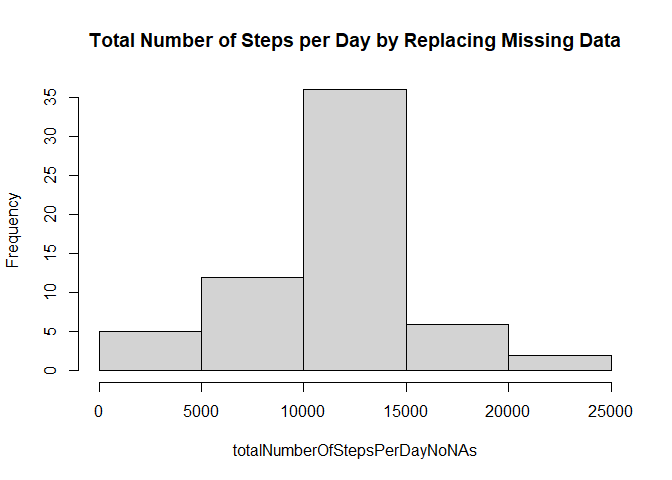
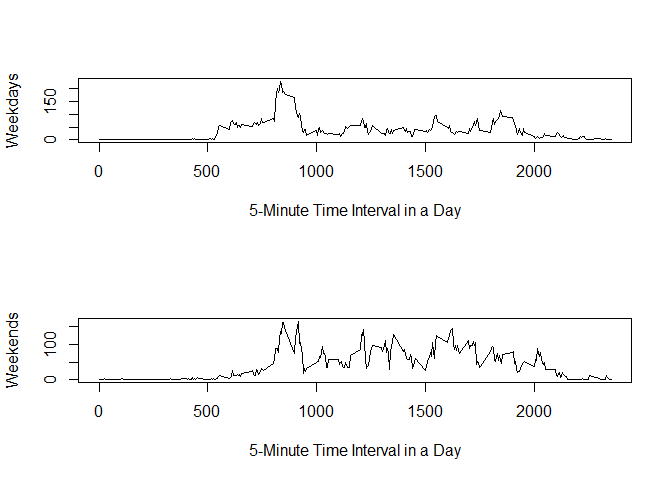

# Assignment 

## Loading and preprocessing the data

```r
data <- read.csv("activity.csv")
data$date <- as.Date(data$date, "%Y-%m-%d")
```

## What is mean total number of steps taken per day?

```r
NoMissingData <- na.omit(data)
totalNumberOfStepsPerDay <- tapply(NoMissingData$steps, NoMissingData$date, sum)
hist(totalNumberOfStepsPerDay, main = "Total Number of Steps per Day")
```

<!-- -->

```r
totalMean <- mean(totalNumberOfStepsPerDay)
totalMedian <- median(totalNumberOfStepsPerDay)
```

The mean and median of the total number of steps taken per day are 1.0766189\times 10^{4} and 10765 respectively.

## What is the average daily activity pattern?

```r
avgNumberSteps <- tapply(NoMissingData$steps, NoMissingData$interval, mean)
plot(names(avgNumberSteps), avgNumberSteps, type = "l", xlab="5-Minute Time Interval in a Day", ylab="Average Number of Steps Across All Days") 
```

<!-- -->

```r
maxAvg <- max(avgNumberSteps)
posMaxAvg <- which.max( avgNumberSteps ) 
```

The 5-minute interval with the highest average of steps accross all days was 206.1698113 at 8:35 am.

## Imputing missing values

```r
totalMissingValues <- sum(is.na(data$steps))
```

There are 2304 missing values (number of steps column) in the data.

In order to alleviate the missing value problem, we fill the missing data fields with the average of steps accross all days, we proceeded to use the following function to process the data:


```r
fillNAs <- function( df )
{
	#This function receives a dataframe with NAs in the steps column and replaces them with the average number of steps by interval accross all days.
	
	NoMissingData <- na.omit(df)
	avgNumberSteps <- tapply(NoMissingData$steps, NoMissingData$interval, mean)
	tinter = 0
	for(i in 1:dim(df)[1])
	{
		tinter = tinter + 1
		if( is.na(df$steps[i]) )
		{
			df$steps[ i ] <- avgNumberSteps[ tinter ]
		}
		if( tinter == 288 )
		{
			tinter <- 0
		}		
	}

	return(df)	
}

filledData <- fillNAs(data)
```

We can appreciate that there are no NAs in our new dataframe filledData: 0.
Performing the same analysis with the complemented data we have:


```r
totalNumberOfStepsPerDayNoNAs <- tapply(filledData$steps, filledData$date, sum)
hist(totalNumberOfStepsPerDayNoNAs, main = "Total Number of Steps per Day by Replacing Missing Data")
```

<!-- -->

```r
totalMeanNoNAs <- mean(totalNumberOfStepsPerDayNoNAs)
totalMedianNoNAs <- median(totalNumberOfStepsPerDayNoNAs)
```

The mean and median of the total number of steps taken per day for the replaced missing data are 1.0766189\times 10^{4} and 1.0766189\times 10^{4} respectively. We can logically observe that there is no change in the mean number of steps per day given that the filled data was calculated the averages in the same ranges of the data. However, we see an increase in the median, by being replaced by the median number.
In general, we can observe an increment of steps toward the mean value reducing variance.

## Are there differences in activity patterns between weekdays and weekends?

We construct a time series plot with two panes to compare activity levels in terms of steps taken either in weekdays or weekends.


```r
filledData$TypeOfDay <- factor(ifelse(weekdays(filledData$date) == "Saturday" | weekdays(filledData$date) == "Sunday", "weekend", "weekday"))
weekdaysData <- filledData[filledData$TypeOfDay == "weekday",]
weekendData <- filledData[filledData$TypeOfDay == "weekend",]
avgStepsWeekdays <- tapply(weekdaysData$steps, weekdaysData$interval, mean)
avgStepsWeekend <- tapply(weekendData$steps, weekendData$interval, mean)
par(mfrow=c(2,1))
plot(names(avgStepsWeekdays), avgStepsWeekdays, type = "l", xlab="5-Minute Time Interval in a Day", ylab="Weekdays")
plot(names(avgStepsWeekend), avgStepsWeekend, type = "l", xlab="5-Minute Time Interval in a Day", ylab="Weekends")
```

<!-- -->

From the graph above we can conclude that from the observed sample data there are more steps taken in weekends than on weekdays. That might be explained because the subject in question could have a sedentary life at work.
